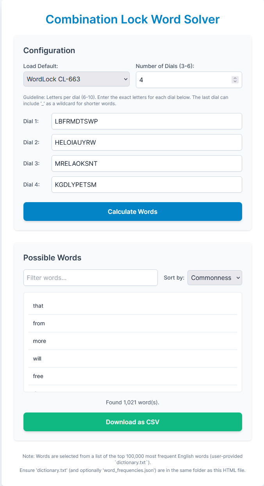

# WordLock_Solver

## **Overview**

The Combination Lock Word Solver is a single-page web application designed to help users find all possible dictionary words from a letter-based combination lock. It allows for customizable lock configurations, including the number of dials and the letters on each dial. Found words can be sorted, filtered, and downloaded.

You can find a hosted version of this application at [https://tgjohnst.github.io/WordLock_Solver/](https://tgjohnst.github.io/WordLock_Solver/).

## **Features**

* **Customizable Lock Configuration:**  
  * **Number of Dials:** Set between 3 and 6 dials.  
  * **Letters per Dial:** Input 6 to 10 letters for each dial. The letters are customizable strings (A-Z).  
  * **Wildcard Character:** Use an underscore (\_) on the *last* dial to represent a null character, allowing the application to find words that are one letter shorter (using the first N-1 dials).  
* **Word Calculation:**  
  * Generates all possible letter combinations based on the dial settings.  
  * Checks combinations against a provided dictionary file to find valid words.  
  * Only returns words that use the full length of the specified dials (or N-1 if \_ is used on the last dial).  
* **Results Display & Management:**  
  * **Word List:** Displays found words in a clear, scrollable list.  
  * **Sorting:** Sort the list of words alphabetically or by "commonness" (if a word frequency file is provided).  
  * **Filtering:** Search and narrow down the word list by typing into a filter box.  
  * **CSV Export:** Download the list of found words as a CSV file.  
* **Default Settings:**  
  * Includes a dropdown menu with pre-configured settings for common lock types (e.g., "WordLock CL-663", "MasterLock PL-004").  
* **User Interface:**  
  * **Responsive Design:** The application is designed to work well on various screen sizes.  
  * **Status Messages:** Provides feedback during operations like loading the dictionary or calculating words.

## Screenshot

## **Setup**

This application is a single HTML file that runs directly in your web browser. However, it relies on external files for its dictionary functionality:

1. **HTML File:** Save the provided code as an HTML file (e.g., lock\_solver.html).  
2. **Dictionary File (dictionary.txt):**  
   * **Required.** This file is essential for the application to find words.  
   * It should be a plain text file with one English word per line, preferably in lowercase.  
   * The application notes that it's intended for use with a list of the top 100,000 most frequent English words, but any comprehensive word list will work.  
   * You can typically find such lists by searching online for "english word list txt" or "common words list txt".  
   * **Place this file in the same directory as your HTML file.**  
3. **Word Frequencies File (word\_frequencies.json):**  
   * **Optional.** This file is needed for the "Sort by Commonness" feature.  
   * It should be a JSON file mapping words (lowercase) to their frequency counts (numbers). Example: {"the": 100000, "of": 80000, ...}.  
   * If this file is not present or is invalid, the "Commonness" sorting option will be disabled or may not function as expected.  
   * **Place this file in the same directory as your HTML file if you wish to use this feature.**

## **How to Use**

1. **Open the Application:** Open the lock\_solver.html file (or whatever you named it) in a modern web browser (e.g., Chrome, Firefox, Edge, Safari).  
2. **Configure Dials:**  
   * **Load Default (Optional):** Select a predefined lock from the "Load Default" dropdown to automatically populate the dial settings.  
   * **Number of Dials:** Choose the number of dials on your lock (3 to 6). The letter input fields will update dynamically.  
   * **Enter Letters:** For each dial, type the letters that appear on it into the corresponding input field.  
     * Use uppercase letters (A-Z).  
     * Each dial should have between 6 and 10 letters.  
     * If your lock allows for a shorter word by effectively skipping the last dial, enter an underscore (\_) as one of the characters on the *last* dial's input field.  
3. **Calculate Words:**  
   * Once the dials are configured, click the "Calculate Words" button.  
   * The application will process the combinations and display any found words. A status message will indicate progress.  
4. **View and Manage Results:**  
   * **Filter:** Type into the "Filter words..." box to dynamically narrow down the displayed list.  
   * **Sort:** Use the "Sort by" dropdown to arrange words alphabetically or by commonness (if available).  
   * **Download:** Click the "Download as CSV" button to save the currently displayed (and sorted) list of words to a CSV file on your computer. Words found using the \_ wildcard will have \_ appended to them.  

## **Technical Details**

* **Frontend:** Built with HTML, Tailwind CSS (for styling, loaded via CDN), and vanilla JavaScript.  
* **Dictionary Source:** The application is designed to work with a user-provided dictionary.txt. The interface notes an expectation of a list containing approximately the top 100,000 most frequent English words for optimal relevance, but the actual content is up to the user.

Enjoy solving your combination locks\!